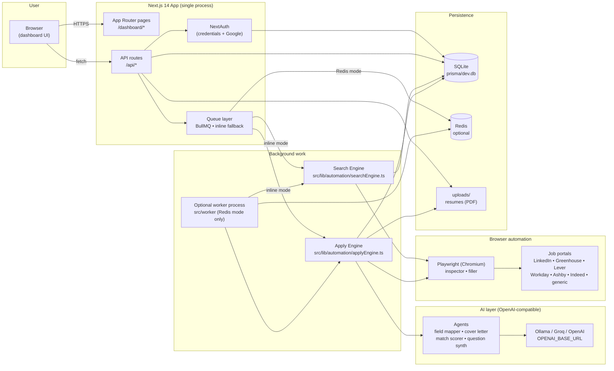
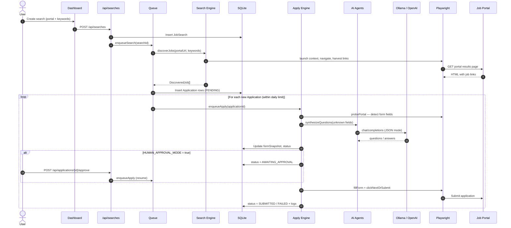
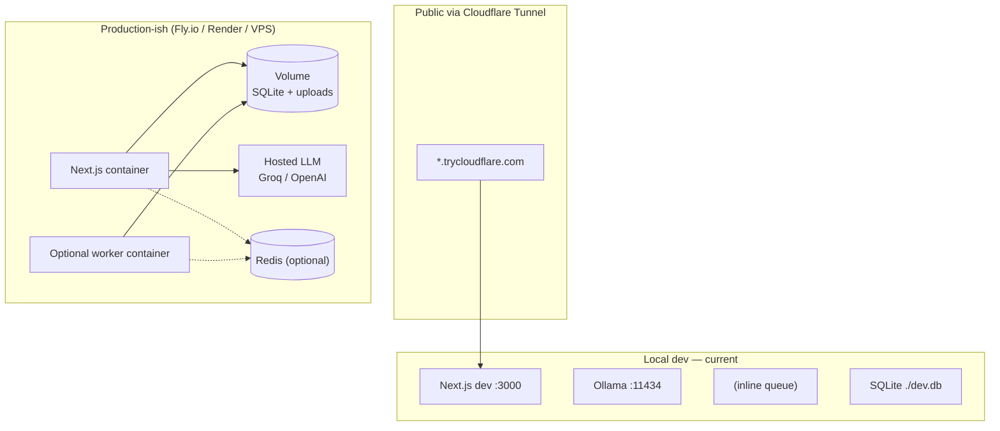

# JobGenie — Architecture

High-level view of how the pieces fit together. Both diagrams render natively
on GitHub.

## System overview

## Apply flow (one job, end-to-end)

## Queue modes

JobGenie ships with two execution modes; the right one is chosen
automatically by probing `REDIS_URL` at boot
([src/lib/queue.ts](../src/lib/queue.ts)).

| Mode | When it's used | Job execution | Worker process |
|---|---|---|---|
| **Redis** | `REDIS_URL` reachable | BullMQ → durable jobs, retries, concurrency | Run `npm run worker` separately |
| **Inline** | Redis unreachable | `setImmediate` inside the Next.js process | Not needed — web process does the work |

Inline mode keeps local dev (and free-tier hosting like Fly.io) zero-dependency.

## Deployment topologies

## Key files

| Concern | File |
|---|---|
| Data model | [prisma/schema.prisma](../prisma/schema.prisma) |
| Auth | [src/lib/auth.ts](../src/lib/auth.ts) · [src/lib/session.ts](../src/lib/session.ts) |
| Queue + inline fallback | [src/lib/queue.ts](../src/lib/queue.ts) |
| AI client + prompts | [src/lib/ai/openai.ts](../src/lib/ai/openai.ts) · [src/lib/ai/agent.ts](../src/lib/ai/agent.ts) |
| Browser primitives | [src/lib/automation/browser.ts](../src/lib/automation/browser.ts) |
| Portal inspector | [src/lib/automation/inspector.ts](../src/lib/automation/inspector.ts) |
| Form filler | [src/lib/automation/filler.ts](../src/lib/automation/filler.ts) |
| Job discovery | [src/lib/automation/searchEngine.ts](../src/lib/automation/searchEngine.ts) |
| Apply orchestration | [src/lib/automation/applyEngine.ts](../src/lib/automation/applyEngine.ts) |
| Worker entrypoint | [src/worker/index.ts](../src/worker/index.ts) |
| Route error helper | [src/lib/route.ts](../src/lib/route.ts) |
